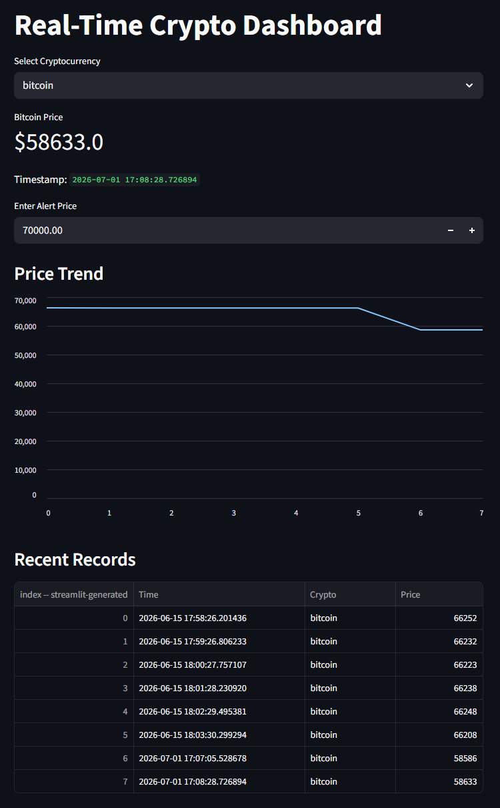

# ₿ Real-Time Crypto Dashboard

## 📌 Project Overview

The Real-Time Crypto Dashboard is an interactive web application built using **Python** and **Streamlit**. It retrieves live cryptocurrency market data from the **CoinGecko API** and displays key information such as current prices, market capitalization, trading volume, and price trends in an easy-to-use dashboard.

---

## 🎯 Objectives

- Fetch real-time cryptocurrency market data.
- Display live prices of selected cryptocurrencies.
- Visualize market trends through interactive charts.
- Build an easy-to-use dashboard for monitoring cryptocurrency performance.

---

## 🛠️ Tools & Technologies

- Python
- Streamlit
- Pandas
- Plotly
- CoinGecko API

---

## 📂 Features

- 📈 Real-Time Cryptocurrency Prices
- 💹 Interactive Price Charts
- 📊 Market Capitalization & Trading Volume
- 🔄 Automatic Data Refresh
- 🪙 Multiple Cryptocurrency Selection
- 🌐 API-Based Live Data Retrieval

---

## 📁 Repository Structure

```
real-time-crypto-dashboard/
│
├── README.md
├── app.py
├── requirements.txt
└── crypto_data.csv (generated while running the application)
```

---

## 🚀 Installation & Usage

### 1. Clone the Repository

```bash
git clone https://github.com/bhavyat-23/real-time-crypto-dashboard.git
```

### 2. Navigate to the Project Folder

```bash
cd real-time-crypto-dashboard
```

### 3. Install Dependencies

```bash
pip install -r requirements.txt
```

### 4. Run the Application

```bash
streamlit run app.py
```

The dashboard will open automatically in your web browser.

---

## 📊 Dashboard Preview

> Add a screenshot of the running dashboard here after uploading `crypto_dashboard.png`.

```markdown

```

---

## 📌 Key Highlights

- Retrieves live cryptocurrency prices using the CoinGecko API.
- Displays market capitalization and trading volume.
- Provides interactive charts for better visualization.
- Allows users to monitor multiple cryptocurrencies in real time.
- Automatically refreshes data to keep information up to date.

---

## 📚 Skills Demonstrated

- Python Programming
- Streamlit Application Development
- REST API Integration
- Data Analysis
- Data Visualization
- Dashboard Development
- Real-Time Data Processing

---

## 👤 Author

**Bhavya Tagadia**

GitHub: https://github.com/bhavyat-23

---
